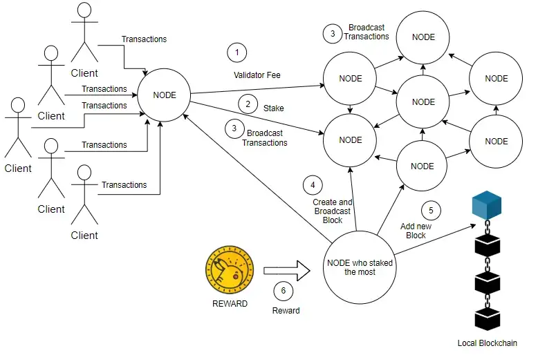

# PoS Implementation

From [this fine walkthrough](https://medium.com/coinmonks/implementing-proof-of-stake-part-6-c811ce78ab0f).

I find a lot of value in ELI5 implementations. Here I ran everything in TypeScript and rewrote a couple of functions to make them more elegant or intuitive (for me).

## ESM issues
The web now supports modules, but this module system is not so compatible with Node and still less TS.

fetch is at 2.6.5 to avoid issues.

## Questions for Later

It's clear to me that in a PoW system any validator out of touch with the network will temporarily have a different chain. And we know about failures to reach consensus and how they resolve.

In PoS it seems we have many transactions on many nodes. And then they elect a validator using staking.

Also, I am a little confused about how a WS server works. Here it seems a server has many sockets to connect with peers. It is not really a server-client model.
